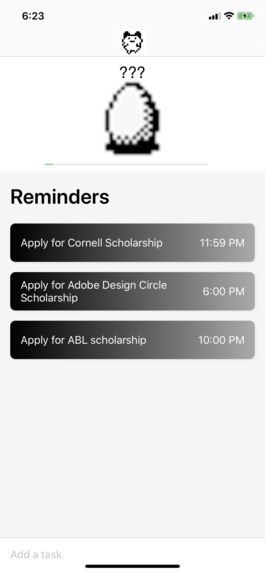
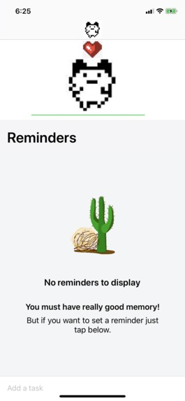

# FinBit

Finbit is an iOS app for college students that encourages financial accountability through reminders for filing taxes and scholarship deadlines. In addition to being able to set reminders, FinBit also includes a game component in which upon completion of tasks, an 8-bit egg will hatch into a creature. As you grow more creatures, you grow your financial literacy. This incentivizes the user and keeps them accountable through gameification. 

  
  Wireframe concept

 
 

    
  Screenshots of the app
 

  
 
# Installation

Download the repository and run the .workspace file. See it in action either on the device simulator within XCode or your own iPhone!
